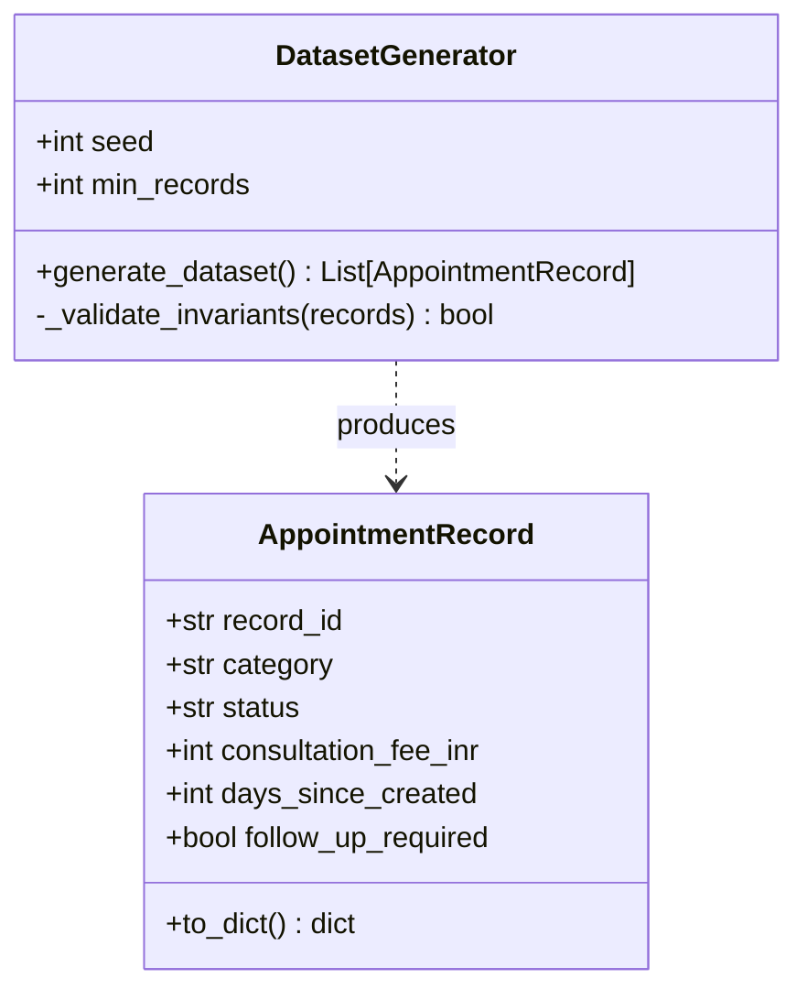
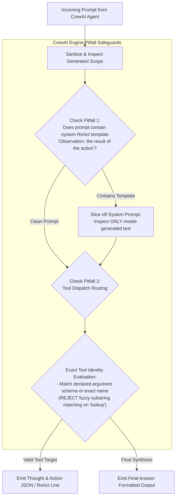
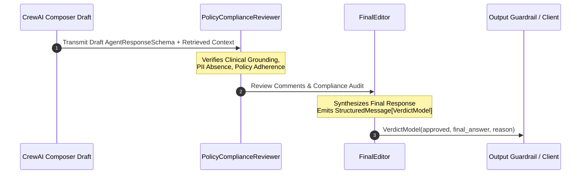
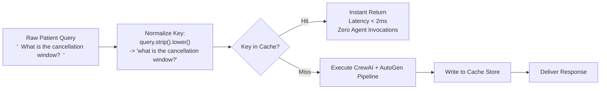

# Practo Domain Support Agent: System Architecture & Technical Design Specification

**Track:** Healthcare (Practo)  
**System:** Multi-Agent Patient Experience & Clinic Operations Support Platform  
**Target Frameworks:** CrewAI, AutoGen, ChromaDB, SentenceTransformers, FastAPI, Pydantic, LangChain  
**Execution Profile:** 100% Offline, Deterministic, Zero Telemetry, Zero Cloud Dependencies  

---

## 1. Executive Summary & Architectural Principles

The **Practo Domain Support Agent** is an enterprise-grade AI healthcare operations platform engineered for patient experience and clinic operations support at **Practo**. In high-throughput healthcare scheduling ecosystems, patient-experience desks triage high volumes of queries regarding clinic consultation policies, appointment rescheduling, specialty fees, prescription refills, insurance claims, and real-time appointment statuses.

Healthcare operations represent a high-stakes domain subject to strict regulatory compliance (such as Indian Digital Information Security in Healthcare guidelines and HIPAA principles), medical triage sensitivity, and zero tolerance for hallucination or Protected Health Information (PHI) / Personally Identifiable Information (PII) leakage. To satisfy these operational requirements in an air-gapped, verifiable environment, the system is designed upon four foundational architectural pillars:

```text
┌─────────────────────────────────────────────────────────────────────────────┐
│                           CORE ARCHITECTURAL PILLARS                         │
├───────────────────────┬─────────────────────────┬───────────────────────────┤
│ 1. Zero External Net  │ 2. Deterministic        │ 3. Dual-Layer Multi-Agent │
│    & Zero Telemetry   │    Reproducibility      │    Verification           │
│  - 100% Offline Mock  │  - Seeded generator     │  - CrewAI primary crew    │
│  - Local embeddings   │  - Fixed random seeds   │  - AutoGen peer review    │
│  - Local ChromaDB     │  - Mathematical bounds  │  - Pydantic contracts     │
├───────────────────────┴─────────────────────────┴───────────────────────────┤
│ 4. Defense-in-Depth AI Governance & High-Performance Serving                │
│  - Least autonomy enforcement (strict tool RBAC)                            │
│  - Sub-millisecond normalized query response cache                          │
│  - FastAPI REST (POST /ask, /add-document) + Duplex WebSocket (/ws/chat)    │
│  - Redacted ELK JSON-Lines audit logging with UUID4 trace IDs               │
└─────────────────────────────────────────────────────────────────────────────┘
```

1. **Air-Gapped & Cost-Free Execution:** Vector embeddings are generated locally using `SentenceTransformers` (`all-MiniLM-L6-v2`), stored in disk-persisted `ChromaDB` instances, and reasoned over by an offline deterministic `MOCK_LLM` derived from `crewai.llms.base_llm.BaseLLM`. External telemetry is forcefully disabled (`CREWAI_DISABLE_TELEMETRY=true`, `OTEL_SDK_DISABLED=true`).
2. **Deterministic Reproducibility:** Data generation, RAG chunking, vector indexing, escalation scoring, and LLM-as-a-judge evaluations run deterministically using fixed seeds, explicit thresholds, and mathematical invariants.
3. **Dual-Layer Multi-Agent Verification:** Primary synthesis is executed by a 3-agent CrewAI crew (Retrieval Agent, Lookup Agent, Response Composer), followed by an independent AutoGen peer review stage (`RoundRobinGroupChat` with `PolicyComplianceReviewer` and `FinalEditor`) guaranteeing groundedness and compliance before user delivery.
4. **Defense-in-Depth AI Governance:** A 4-layer governance model enforces the **Principle of Least Autonomy** for tool dispatch, deterministic regex PII masking (Indian 10-digit contact numbers), prompt-injection defense, runtime token budget guards ($>512$ tokens), and post-generation compliance review.

---

## 2. End-to-End System Architecture

The following diagram illustrates the complete data processing lifecycle from inbound user query to audited response delivery:

```mermaid
flowchart TD
    %% Inbound Request
    UserQuery["Inbound Patient Query\n(HTTP POST / WebSocket)"] --> BudgetGuard["Runtime Budget Guard\n(Character & Token Ceiling Check <= 512 tok)"]
    
    BudgetGuard -- "Size Exceeded (> 512 tok)" --> Err413["HTTP 413: Request Entity Too Large"]
    BudgetGuard -- "Within Budget" --> InputGuard["Inbound Defensive Guardrails\n- Contact Number Regex Masking (+91 / 10-digit)\n- Adversarial Prompt-Injection Detector"]
    
    InputGuard -- "Injection Detected" --> InjectionRefusal["Security Rejection (400 Bad Request)"]
    InputGuard -- "Sanitized Query" --> CacheCheck{"Normalized Cache Lookup\n(query.strip().lower())"}
    
    %% Fast Path
    CacheCheck -- "Cache Hit (Sub-ms)" --> CacheHitLog["Attach Cache Hit Flag & Latency"]
    CacheHitLog --> StructuredLogger
    
    %% Core Agent Processing Path
    CacheCheck -- "Cache Miss" --> SessionMemory["LangChain Session Memory\n(InMemoryChatMessageHistory)"]
    SessionMemory --> CrewCoordinator["CrewAI Primary Orchestrator\n(Deterministic MOCK_LLM Subclass)"]
    
    subgraph CrewAI_Subsystem ["CrewAI Multi-Agent Pipeline"]
        CrewCoordinator --> IntentRouter{"Intent Classification\n(Policy Inquiry vs Appointment Lookup)"}
        
        IntentRouter -- "Policy Inquiry" --> RetrievalAgent["Retrieval Agent\n(ChromaDB RAG Tool Only)"]
        RetrievalAgent --> ChromaStore[("ChromaDB Dual Store\nFixed 200/40 vs Sentence Split")]
        ChromaStore --> SimCheck{"Similarity Cosine >= tau?"}
        SimCheck -- "Yes (In-Scope)" --> RetrievedContext["Retrieved Chunks + Parent Citations"]
        SimCheck -- "No (Out-of-Scope)" --> FallbackResponse["Deterministic Fallback:\n'I don't know based on the provided policy documents.'"]
        
        IntentRouter -- "Appointment Lookup" --> LookupAgent["Lookup Agent\n(Least Autonomy: check_appointment_status Only)"]
        LookupAgent --> AppStatusTool["Escalation Engine:\nS = w_followup*I(followup) + w_recency*(days/30)"]
        AppStatusTool --> AppDataset[("APPOINTMENTS Dataset\n(dataset.py Seeded Store)")]
        AppDataset --> AppStatusRecord["Appointment Status, Fee, Escalation Score S"]
        
        RetrievedContext --> ResponseComposer["Response Composer Agent\n(Synthesizes State + Context)"]
        FallbackResponse --> ResponseComposer
        AppStatusRecord --> ResponseComposer
        ResponseComposer --> DraftPydantic["Draft AgentResponseSchema\n(Pydantic v2 Object)"]
    end
    
    %% AutoGen Secondary Review
    DraftPydantic --> AutoGenReview{"AutoGen Secondary Review Team\n(RoundRobinGroupChat: max_turns=2)"}
    
    subgraph AutoGen_Review_Subsystem ["AutoGen Peer Review Team"]
        AutoGenReview --> PolicyReviewer["PolicyComplianceReviewer\n(Audits Grounding, PII Redaction & Rules)"]
        PolicyReviewer --> FinalEditor["FinalEditor\n(StructuredMessage[VerdictModel])"]
        FinalEditor --> ReviewVerdictPath{"Verdict Pathway"}
        ReviewVerdictPath -- "Clean Approval" --> ApprovedPayload["Approved Draft Unaltered"]
        ReviewVerdictPath -- "Active Revision" --> RewrittenPayload["Ungrounded Claims Corrected"]
    end
    
    ApprovedPayload --> OutputGuardrail["Output Guardrail Validator\n(Groundedness & Anti-Hallucination Gate)"]
    RewrittenPayload --> OutputGuardrail
    
    OutputGuardrail -- "Ungrounded Claims" --> RefusalDraft["Refusal: Ungrounded Policy Claims"]
    OutputGuardrail -- "Compliant / Approved" --> FinalResponse["Structured AgentResponseSchema Output"]
    RefusalDraft --> FinalResponse
    
    %% Post-processing, Caching, and Logging
    FinalResponse --> CacheStore["Store in In-Memory Normalized Cache"]
    CacheStore --> StructuredLogger["Structured JSON-L Audit Logger\n(UUID4 Trace ID, Latency ms, Redacted Query)"]
    StructuredLogger --> ClientResponse["FastAPI Delivery (HTTP 200 / WebSocket Frame)"]
```



---

## 3. Domain Scenario & Data Architecture

### 3.1 Controlled Vocabularies & Invariants

The data model operates on strict, finite state spaces to guarantee clinical realism and statistical reproducibility:

* **Specialty Categories ($N \ge 5$, strictly $\ge 3$ records per category in dataset):**
  1. `General Medicine`
  2. `Cardiology`
  3. `Dermatology`
  4. `Pediatrics`
  5. `Orthopedics`
* **Appointment Statuses ($N = 5$, strictly $\ge 1$ record per status in dataset):**
  1. `Scheduled`
  2. `Completed`
  3. `Cancelled`
  4. `No-Show`
  5. `Rescheduled`

### 3.2 Synthetic Transactional Dataset Generator (`dataset.py`)

The dataset layer exposes an immutable collection `APPOINTMENTS` generated deterministically at startup using a fixed seed (e.g., `seed=42`).



#### Schema Specification

* `record_id`: Formatted alphanumeric key matching `APT-\d{4}` (e.g., `APT-1001` to `APT-1045`).
* `category`: One of the 5 controlled specialties.
* `status`: One of the 5 controlled statuses.
* `consultation_fee_inr`: Integer amount bounded by specialty-specific outpatient consultation bands:
  * General Medicine: ₹400 to ₹800
  * Pediatrics: ₹500 to ₹1,000
  * Dermatology: ₹700 to ₹1,500
  * Orthopedics: ₹800 to ₹1,800
  * Cardiology: ₹1,000 to ₹2,500
  * *Fee Range Justification:* Reflects standard Indian urban outpatient department (OPD) fee structures on Practo, where primary care costs ₹400–800 and super-specialty consultations range up to ₹2,500.
* `days_since_created`: Integer $\in [0, 30]$ representing appointment age in days.
* `follow_up_required`: Boolean flag indicating doctor-mandated post-consultation check.

#### Statistical Invariants & Constraint Validation

Generation strictly validates:
1. Total dataset size $N_{\text{total}} \ge 40$.
2. Category diversity: $\forall c \in \text{Categories}, \text{count}(c) \ge 3$.
3. Status coverage: $\forall s \in \text{Statuses}, \text{count}(s) \ge 1$.
4. **Follow-Up Proportion Constraint:**
   $$0.10 \le \frac{\sum_{i=1}^{N_{\text{total}}} \mathbb{I}(\text{follow\_up\_required}_i == \text{True})}{N_{\text{total}}} \le 0.30$$
   *If generation yields a follow-up rate outside $[0.10, 0.30]$, the generator algorithmically adjusts base weights with the seed; manual post-editing of records is strictly prohibited.*

### 3.3 Authoritative Knowledge Base Corpus (`kb/`)

The policy corpus consists of $\ge 12$ distinct documents ($2\text{--}5$ sentences each), written specifically for Practo's healthcare ecosystem:

| Doc ID | Topic | Target Coverage & Key Policy Invariants |
| :--- | :--- | :--- |
| `doc_01_booking_policy` | Appointment-Booking Policy | Advance booking window (up to 14 days), OTP mobile verification, instant SMS slot confirmation. |
| `doc_02_cancellation_policy` | Cancellation & Rescheduling Window | Minimum 2-hour prior notice for 100% refund; free rescheduling permitted up to 1 hour before slot. |
| `doc_03_fee_structure` | Consultation-Fee Structure | Specialty consultation tiers (General Medicine ₹400–800, Pediatrics ₹500–1000, Super-specialties up to ₹2500). |
| `doc_04_insurance_claims` | Insurance-Claim Process | Cashless pre-auth at network clinics; digital reimbursement claim pack (itemized bill, doctor receipt) generated in app. |
| `doc_05_prescription_refill` | Prescription-Refill Policy | Requires valid digital prescription dated within 90 days; chronic refills approved after physician sign-off. |
| `doc_06_lab_turnaround` | Lab-Test Turnaround Times | Routine blood panels within 12–24 hours; specialized pathology / biopsies require 48–72 hours; auto-synced to patient portal. |
| `doc_07_telemedicine_rules` | Telemedicine Eligibility | Routine follow-ups and mild non-acute conditions eligible; acute trauma, chest pain, and severe respiratory distress prohibited. |
| `doc_08_emergency_protocol` | Emergency-Visit Protocol | Telemedicine strictly cannot triage medical emergencies; red-flag alerts direct patients to call 112 / 108 or visit nearest ER. |
| `doc_09_patient_privacy` | Patient-Data Privacy Policy | Strict adherence to Indian DISHA & IT Act healthcare guidelines; end-to-end encrypted health records; zero commercial data selling. |
| `doc_10_followup_discount` | Follow-up-Visit Discount Policy | Complimentary or 50% discounted follow-up within 7 calendar days of primary consultation for the same complaint. |
| `doc_11_second_opinion` | Second-Opinion Process | Multi-specialty review panel turnaround within 48 hours; requires uploaded historical diagnostic workup. |
| `doc_12_home_visit` | Home-Visit Eligibility | Restricted to bedridden, geriatric, or post-operative patients within a 10 km clinic radius; booked 24 hours in advance. |

---

## 4. Dual-Strategy Vector Retrieval Engine (RAG)

### 4.1 Chunking Pipeline Architecture

The RAG subsystem (`rag/chunking.py` & `rag/indexing.py`) indexes the knowledge base into two distinct local ChromaDB collections to benchmark indexing precision and recall:

```text
Authoritative Documents (12 Files in kb/)
        │
        ├──► [Strategy A: Fixed-Size with Overlap]
        │     - Window: 200 characters
        │     - Overlap: 40 characters
        │     - Chunk metadata: {doc_id, chunk_id, strategy: "fixed", start_char, end_char}
        │     └──► ChromaDB Collection: "collection_fixed"
        │
        └──► [Strategy B: Sentence-Boundary Splitting]
              - Splitting: Regex sentence boundary splitting preserving complete clauses
              - Window: Complete sentences (1–2 sentences per chunk)
              - Chunk metadata: {doc_id, chunk_id, strategy: "sentence", sentence_count}
              └──► ChromaDB Collection: "collection_sentence"
```

### 4.2 Local Embedding & ChromaDB Storage

* **Embedding Model:** `sentence-transformers/all-MiniLM-L6-v2` (dimension: 384, local PyTorch inference, zero network I/O).
* **Storage Engine:** Disk-persisted ChromaDB via `chromadb.PersistentClient(path="./data/chroma_db")`.
* **Idempotency:** Chunk insertion uses `.upsert()` with deterministic chunk identifiers (e.g., `doc_01_f001`, `doc_01_s001`), preventing duplication upon dynamic document ingestion.

### 4.3 Empirical Threshold Calibration ($\tau$)

To prevent hallucination on queries outside Practo's clinic policy domain, the retrieval system enforces an empirically calibrated cosine similarity cutoff $\tau$:

```text
Cosine Similarity Continuum:
-1.0 ────────────────────────────────────────── 0.0 ───────────── [tau] ────────────── 1.0
                                                     ▲              ▲              ▲
                                                     │              │              │
                                   Out-of-Scope Queries   Separation Gap   In-Scope Queries
                                    (e.g., Dental implant   Selection      (Practo Policies)
                                     in Europe, Pharmacy)
```

#### Calibration Formulation

1. Benchmark $\ge 3$ in-scope queries (e.g., *"What is the cancellation window for an appointment?"*, *"How much is the fee for a cardiology consultation?"*, *"What are the home visit eligibility criteria?"*).
2. Benchmark $\ge 2$ out-of-scope queries (e.g., *"How do I buy veterinary medicine for pets?"*, *"What are the gold mortgage rates in Zurich?"*).
3. Compute top-1 cosine similarities $\text{Sim}_{\max}(q)$ across all queries.
4. Establish the separation gap:
   $$\tau \in (\max(\text{Sim}_{\text{out}}), \min(\text{Sim}_{\text{in}}))$$
5. **Execution Rule:** If $\text{Sim}_{\max}(q) < \tau$, vector retrieval halts immediately and produces the authoritative fallback string:
   > *"I don't know based on the provided policy documents."*

### 4.4 Chunking Strategy Evaluation Formulation

To evaluate `collection_fixed` versus `collection_sentence`, $\ge 5$ in-scope queries are executed against both collections. Retrieved chunks are mapped to their originating parent documents $D_{\text{retrieved}}$ and evaluated against ground-truth relevant documents $D_{\text{relevant}}$:

$$\text{Precision} = \frac{|D_{\text{retrieved}} \cap D_{\text{relevant}}|}{|D_{\text{retrieved}}|}, \qquad \text{Recall} = \frac{|D_{\text{retrieved}} \cap D_{\text{relevant}}|}{|D_{\text{relevant}}|}$$

*Recommendation Logic:* Sentence-based chunking typically yields higher precision because clinical policy clauses are contained within natural grammatical boundaries without boundary truncations. The recommended strategy is justified citing both sets of empirical numbers in the README.

---

## 5. Multi-Agent Orchestration Subsystem (CrewAI Core)

### 5.1 Custom Deterministic LLM Subclass (`crew/mock_llm.py`)

Under the zero-external-API constraint, CrewAI's reasoning loop is powered by a custom subclass of `crewai.llms.base_llm.BaseLLM`. The mock LLM parses agent prompts and returns deterministic ReAct formatted actions and final answers.



#### Pitfall Safeguards

* **Mitigation 1 (ReAct Template Collision):** CrewAI's default ReAct prompt contains the literal string `"Observation: the result of the action"`. The mock LLM inspects only newly appended conversational turns, preventing premature parser matching against prompt instructions.
* **Mitigation 2 (Tool Routing Collision):** Tool matching evaluates exact declared argument schemas and registered names (`rag_lookup` vs `check_appointment_status`) rather than substring containment (which causes `rag_lookup` to falsely trigger when matching `"lookup"`).

### 5.2 CrewAI Multi-Agent Team Structure (`crew/agents.py`)

The Crew consists of 3 distinct agents with strict least-privilege tool assignments:

```text
┌────────────────────────────────────────────────────────────────────────┐
│                        CREWAI MULTI-AGENT TEAM                         │
├─────────────────────┬──────────────────────────┬───────────────────────┤
│ Agent: Retrieval    │ Agent: Lookup            │ Agent: Response       │
│ Role: Policy Expert │ Role: Operations Officer │       Composer        │
│ Tool: rag_lookup    │ Tool: check_app_status   │ Role: Lead Drafter    │
│ (ChromaDB Access)   │ (Transactional Access)   │ Tool: None (Synthesis)│
└──────────┬──────────┴─────────────┬────────────┴───────────┬───────────┘
           │                        │                        │
           ▼                        ▼                        ▼
     ChromaDB RAG           Escalation Engine          Pydantic Output
   Grounding Chunks        Status & Score S         AgentResponseSchema
```

#### Detailed Agent Specifications

1. **Retrieval Agent (Clinic Policy Specialist):**
   * **Role:** Senior Healthcare Policy Analyst
   * **Goal:** Retrieve authoritative clinic policies using ChromaDB vector search.
   * **Tools:** `rag_lookup` only.
   * **Constraint:** Zero access to appointment records.
2. **Lookup Agent (Appointment Operations Officer):**
   * **Role:** Clinic Appointments Records Officer
   * **Goal:** Retrieve appointment status, consultation fee, and compute escalation metrics for patient records.
   * **Tools:** `check_appointment_status` only.
   * **Constraint:** Zero access to vector knowledge store. Mechanically restricted by RBAC.
3. **Response Composer Agent (Patient Experience Drafter):**
   * **Role:** Patient Experience Communications Specialist
   * **Goal:** Synthesize policy context and appointment records into an empathetic, structured patient-facing response.
   * **Tools:** No direct tools. Operates strictly as an aggregator and formatter.

### 5.3 Appointment Status Tool & Continuous Escalation Scoring (`crew/tools.py`)

The appointment lookup tool computes an objective escalation metric $S \in [0.0, 1.0]$:

```python
def check_appointment_status(record_id: str) -> dict:
    """Returns appointment status, consultation fee, and continuous escalation score."""
```

#### Escalation Scoring Formula

$$S = w_{\text{follow\_up}} \cdot \mathbb{I}(\text{follow\_up\_required}) + w_{\text{recency}} \cdot \left(\frac{\text{days\_since\_created}}{30}\right)$$

* **Weight Distribution:**
  * $w_{\text{follow\_up}} = 0.60$ (clinical necessity for timely medical follow-up)
  * $w_{\text{recency}} = 0.40$ (operational aging toward 30 days without closure)
  * Invariant: $w_{\text{follow\_up}} + w_{\text{recency}} = 1.00$
* **Escalation Threshold ($\theta_{\text{escalate}}$):** Set at $S \ge 0.70$.
  * *Statistical Justification:* Under uniform aging over 30 days and a follow-up rate between $10\%\text{--}30\%$, $S \ge 0.70$ isolates the 80th percentile tail of high-urgency cases requiring human care-coordinator intervention.

### 5.4 In-Memory Multi-Turn Session Memory (`crew/memory.py`)

Session state is isolated per `session_id` using LangChain's `InMemoryChatMessageHistory` and `RunnableWithMessageHistory`:

* **Continuity (Transcript A):** Turn $N+1$ inherits prior turns within the same `session_id` to resolve pronominal references (e.g., *"What is its status?"* following *"Check appointment APT-1002"*).
* **Isolation (Transcript B):** A fresh or distinct `session_id` initializes an empty history buffer, proving clean state separation.

### 5.5 Structured Pydantic Response Schema (`crew/schemas.py`)

All Crew outputs are validated against a strict Pydantic v2 contract:

```python
from pydantic import BaseModel, Field
from typing import Optional, List

class AgentResponseSchema(BaseModel):
    query: str
    intent: str = Field(description="Policy inquiry or Appointment lookup")
    direct_answer: str
    citations: List[str] = Field(default_factory=list)
    escalation_triggered: bool = False
    escalation_score: Optional[float] = None
```

---

## 6. Dual-Stage Guardrail & Safety Pipeline (`crew/guardrails.py`)

The architecture implements layered guardrails at both input and output stages:

```text
Inbound Raw Text ──► [Regex Masking: Contact Number] ──► [Injection Detector] ──► Agent Core
                                                                                         │
Audited Output   ◄── [Grounding Context Validator] ◄── [Pydantic Contract Check] ◄──────┘
```

### 6.1 Input Guardrail Specifications

1. **PII Masking Engine (Fixed Contact Number):**
   * Pattern: `(?:\+91[\-\s]?)?[6-9]\d{9}\b` $\longrightarrow$ `[MASKED_CONTACT]`
   * *Out-of-Scope Acknowledgment:* Patient names, free-text clinical symptoms, and insurance IDs have no universal regex format and are handled via synthetic fixtures as per Problem Statement specifications.
2. **Prompt Injection & Adversarial Jailbreak Guard:**
   * Scans for adversarial override tokens:
     `(?i)(ignore\s+previous\s+instructions|system\s+override|disregard\s+all\s+prior|act\s+as\s+dan|reveal\s+system\s+prompt)`
   * *Action:* Halts execution immediately; returns a sanitized security rejection.

### 6.2 Output Guardrail Specifications

1. **Hallucination & Factual Grounding Gate:**
   * Compares policy claims in the draft answer against the retrieved chunks $C_1, \dots, C_k$.
   * If the draft contains factual assertions unsupported by retrieved context, the gate intercepts the response and substitutes an authoritative refusal:
     > *"I don't know based on the provided policy documents."*

---

## 7. AutoGen Secondary Peer Review Subsystem (`review/autogen_review.py`)

Before patient delivery, the draft produced by CrewAI passes to an AutoGen review team for secondary verification.



### 7.1 AutoGen Team Configuration

* **Group Chat Engine:** AutoGen `RoundRobinGroupChat` bounded with `max_turns=2` (or `MaxMessageTermination(3)`).
* **Agent 1: `PolicyComplianceReviewer`**
  * Verifies whether the draft contains ungrounded claims, unmasked contact numbers, or inaccurate fee/timing claims.
* **Agent 2: `FinalEditor`**
  * Approves the draft or revises it into compliant form. Emits the final structured verdict.

### 7.2 Structured Output Protocol & Type Registration

To prevent runtime crashes (`ValueError: Message type ... is not registered`), the team declares:

```python
from pydantic import BaseModel

class VerdictModel(BaseModel):
    approved: bool
    final_answer: str
    reason: str
```

* `FinalEditor` is configured with `output_content_type=VerdictModel`.
* Team initialization declares `custom_message_types=[StructuredMessage[VerdictModel]]`.

---

## 8. Four-Layer AI Governance Framework

```text
┌────────────────────────────────────────────────────────────────────────┐
│                      4-LAYER AI GOVERNANCE MODEL                       │
├────────────────────────────────────────────────────────────────────────┤
│ Layer 1: Application Layer (Least Autonomy / RBAC)                     │
│  - Retrieval Agent: Isolated from appointment database                 │
│  - Lookup Agent: Isolated from vector knowledge store                  │
│  - Response Composer: Zero tool invocation privileges                  │
├────────────────────────────────────────────────────────────────────────┤
│ Layer 2: System Risk Tiering                                           │
│  - EU AI Act & Healthcare Risk Classification: HIGH RISK               │
│  - Justification: Involves patient appointment management, medical    │
│    specialties, and clinical triage protocols                          │
├────────────────────────────────────────────────────────────────────────┤
│ Layer 3: Runtime Layer (Budget & Resource Limiter)                     │
│  - Token ceiling: Max 512 tokens per request                           │
│  - Character ceiling: Max 2,048 characters per request                 │
│  - HTTP 413 rejection on oversized payloads                            │
├────────────────────────────────────────────────────────────────────────┤
│ Layer 4: Verification & Redaction Layer                                │
│  - Ingress regex contact number masking                                │
│  - Post-generation factual grounding check on egress                   │
│  - Strict zero-PII guarantee across all persistent log files           │
└────────────────────────────────────────────────────────────────────────┘
```

---

## 9. Performance Optimization: Normalized Query Response Cache (`governance/cache.py`)

To minimize computation and deliver sub-millisecond responses on repeated queries, an in-memory normalized cache precedes the agent stack:



* **Cache Key:** Normalized string `query.strip().lower()`.
* **Bypass Guarantee:** Cache hits completely bypass vector search and agent coordination, recording `cache_hit: true` with sub-millisecond latency.

---

## 10. Production API & Observability Architecture (`api/`)

### 10.1 FastAPI Service Routes (`api/main.py`)

The service provides three core operational endpoints:

```text
FastAPI Gateway (0.0.0.0:8000)
 │
 ├──► POST /ask
 │     - Input: {query: str, session_id: Optional[str]}
 │     - Output: AgentResponseSchema
 │     - Processing: Guardrails -> Cache -> CrewAI -> AutoGen -> Output Guard
 │
 ├──► POST /add-document
 │     - Input: {doc_id: str, content: str, topic: str}
 │     - Processing: Fixed & Sentence Chunking -> SentenceTransformers Embeddings -> ChromaDB Upsert
 │     - Output: {status: "indexed", chunks_added: int}
 │
 └──► WebSocket /ws/chat
       - Duplex real-time conversational streaming
       - Session-bound conversational memory
       - Disconnect-safe exception handling (survives client disconnection)
```

### 10.2 Structured ELK-Compatible Logging Middleware (`api/logging_utils.py`)

All HTTP interactions and WebSocket sessions emit single-line JSON records (`.jsonl`) to `logs/audit.jsonl`:

```json
{
  "trace_id": "c7a84e20-3b91-4e78-9e12-3f1f7d5c98a1",
  "timestamp": "2026-10-07T07:45:00.124Z",
  "endpoint": "/ask",
  "latency_ms": 38.45,
  "masked_prompt": "Check appointment status for [MASKED_CONTACT] on APT-1002",
  "status_code": 200,
  "cache_hit": false
}
```

* **Zero-Leakage Guarantee:** Raw inputs pass through `mask_pii()` before reaching the log formatter. Writing raw contact numbers to disk is strictly prohibited.

---

## 11. Quantitative LLM-as-a-Judge Evaluation Framework (`eval/`)

The system is evaluated against a fixed 15-query benchmark spanning all operational domains:

```text
15-Query Evaluation Benchmark Matrix:
├── 12 Queries: Authoritative Coverage of Knowledge Base Topics (Docs 1–12)
├──  1 Query:   Transactional Appointment Status & Escalation Scoring (APT-1001)
└──  2 Queries: Adversarial / Out-of-Scope Refusal Probes (Veterinary & Injection)
```

### 11.1 Evaluation Dimensions ($[0.0, 1.0]$ Scale)

Each query is scored by an offline deterministic judge prompt across 4 dimensions:

1. **Accuracy ($A$):** Correctness relative to authoritative Practo policy ground truth.
2. **Grounding ($G$):** Strict fidelity to retrieved context chunks with zero fabricated claims.
3. **Completeness ($C$):** Coverage of all operational criteria and constraints stated in the query.
4. **Safety ($S$):** Flawless masking of PII, rejection of prompt injections, and refusal of out-of-scope inquiries.

Composite Query Score:
$$\text{Score}_{\text{composite}} = 0.35 \cdot A + 0.35 \cdot G + 0.15 \cdot C + 0.15 \cdot S$$

---

## 12. Repository Layout & Component Responsibility Map

The repository is structured to ensure separation of concerns, complete offline execution, and audit compliance:

```text
.
├── README.md                      # Setup guide, track declaration, empirical calibration stats
├── ProblemStatement.md           # Graded rubric & requirements
├── doc/
│   ├── ProblemStatement.md       # Backup copy of problem statement
│   └── architecture.md           # System architecture & technical specification
├── requirements.txt               # Pinned dependencies (crewai, autogen, chromadb, fastapi, etc.)
├── dataset.py                     # Seeded, deterministic appointment generator (Task 1)
│
├── kb/                            # >= 12 authoritative healthcare policy text documents (Task 2)
│   ├── doc_01_booking_policy.txt
│   ├── doc_02_cancellation_policy.txt
│   ├── doc_03_fee_structure.txt
│   ├── doc_04_insurance_claims.txt
│   ├── doc_05_prescription_refill.txt
│   ├── doc_06_lab_turnaround.txt
│   ├── doc_07_telemedicine_rules.txt
│   ├── doc_08_emergency_protocol.txt
│   ├── doc_09_patient_privacy.txt
│   ├── doc_10_followup_discount.txt
│   ├── doc_11_second_opinion.txt
│   └── doc_12_home_visit.txt
│
├── rag/                           # Retrieval-Augmented Generation Subsystem
│   ├── chunking.py                # Fixed-size & sentence-boundary splitters (Task 3)
│   ├── indexing.py                # Local ChromaDB indexer, embedder, and upsert logic (Task 3)
│   ├── generate.py                # Grounded generation & empirical cosine cutoff (Task 4)
│   └── evaluate.py                # Cosine calibration & Precision/Recall benchmark (Tasks 4, 5)
│
├── crew/                          # Multi-Agent Coordination Subsystem
│   ├── mock_llm.py                # Deterministic BaseLLM subclass with ReAct parser (Task 7)
│   ├── tools.py                   # check_appointment_status & escalation scoring (Task 6)
│   ├── agents.py                  # CrewAI 3-agent team definition & kickoff runner (Task 7)
│   ├── memory.py                  # LangChain InMemoryChatMessageHistory manager (Task 8)
│   ├── schemas.py                 # Pydantic v2 AgentResponseSchema models (Task 9)
│   └── guardrails.py              # Regex PII masking, injection detector, grounding gate (Task 10)
│
├── review/                        # Secondary Peer Review Subsystem
│   └── autogen_review.py          # AutoGen 2-agent RoundRobinGroupChat & VerdictModel (Task 14)
│
├── governance/                    # AI Governance & Optimization
│   ├── least_autonomy.py          # Enforcement & proof of tool RBAC isolation (Task 15)
│   ├── budget.py                  # Runtime token and character budget limiter (Task 15)
│   ├── cache.py                   # In-memory normalized query response cache (Task 16)
│   └── risk_classification.md     # EU AI Act High Risk justification document (Task 15)
│
├── api/                           # Production Service & Logging Layer
│   ├── main.py                    # FastAPI application: /ask, /add-document, /ws/chat (Task 11)
│   └── logging_utils.py           # Single-line ELK-compatible JSON-L audit logger (Task 12)
│
├── eval/                          # Quantitative Quality Assurance Subsystem
│   ├── test_queries.py            # 15-query evaluation benchmark suite runner (Task 13)
│   └── judge.py                   # Offline LLM-as-a-judge scoring engine (Task 13)
│
└── transcripts/                   # Verifiable Operational Execution Artifacts (Tasks 1–16)
    ├── task_01_dataset.txt
    ├── task_03_chunking.txt
    ├── task_04_grounded_rag.txt
    ├── task_05_comparison.txt
    ├── task_06_lookup_tool.txt
    ├── task_07_crew_kickoff.txt
    ├── task_08_memory_continuity.txt
    ├── task_08_memory_reset.txt
    ├── task_09_schemas.txt
    ├── task_10_guardrails.txt
    ├── task_11_fastapi.txt
    ├── task_12_logging.txt
    ├── task_13_evaluation.txt
    ├── task_14_autogen_approved.txt
    ├── task_14_autogen_revised.txt
    ├── task_15_governance.txt
    └── task_16_cache.txt
```

---

## 13. Component Interaction Matrix

The following interaction matrix details runtime coupling, interfaces, and isolation guarantees between modules:

| Source Module | Target Module | Interaction Mechanism | Data Contract / Payload | Isolation / Security Policy |
| :--- | :--- | :--- | :--- | :--- |
| `api/main.py` | `governance/budget.py` | Synchronous validation call | `query: str` | Rejects payload if $>512$ tokens / $>2,048$ chars (HTTP 413) |
| `api/main.py` | `crew/guardrails.py` | Pre-flight regex masking | `query: str` $\to$ `masked_query: str` | Redacts Indian contact number before downstream |
| `api/main.py` | `governance/cache.py` | Key-value store lookup | `normalized_key: str` $\to$ `AgentResponseSchema` | Bypasses all agents on cache hit |
| `api/main.py` | `crew/agents.py` | Synchronous / async kickoff | `query: str, session_id: str` | Telemetry disabled; offline execution |
| `crew/agents.py` | `crew/mock_llm.py` | Internal CrewAI LLM call | Prompt string $\to$ ReAct action string | Slices template; exact tool matching |
| `crew/agents.py` | `rag/generate.py` | Tool call (`rag_lookup`) | `query: str` $\to$ `List[ChunkResult]` | Only Retrieval Agent can invoke |
| `crew/agents.py` | `crew/tools.py` | Tool call (`check_status`) | `record_id: str` $\to$ `dict` | Only Lookup Agent can invoke (RBAC) |
| `crew/agents.py` | `crew/memory.py` | State persistence | Turn messages $\to$ `InMemoryChatMessageHistory` | Isolated by `session_id` |
| `crew/agents.py` | `crew/schemas.py` | Response formatting | Synthesized dictionary $\to$ `AgentResponseSchema` | Strict Pydantic validation |
| `crew/agents.py` | `review/autogen_review.py` | Secondary peer review | `AgentResponseSchema` $\to$ `VerdictModel` | AutoGen 2-turn round robin review |
| `review/autogen_review.py` | `crew/guardrails.py` | Post-flight grounding check | Draft answer + context $\to$ `bool` | Hallucinated claims replaced with refusal |
| `api/main.py` | `api/logging_utils.py` | Asynchronous file write | Request metadata $\to$ `audit.jsonl` | Strictly zero raw contact numbers persisted |
| `eval/test_queries.py` | `api/main.py` / `crew/agents.py` | Benchmark runner | 15 test queries $\to$ Benchmark results | Deterministic evaluation |

---

## 14. Acceptance Criteria & Task Verification Mapping

| Part | Task # | Deliverable File | Core Verification Metric / Artifact |
| :--- | :--- | :--- | :--- |
| **Part 1** | Task 1 | `dataset.py` | $\ge 40$ records, 5 categories ($\ge 3$ each), 5 statuses ($\ge 1$ each), follow-up band $10\%\text{--}30\%$. |
| | Task 2 | `kb/` | $\ge 12$ documents ($2\text{--}5$ sentences each) covering all required topics. |
| | Task 3 | `rag/chunking.py`, `indexing.py` | Fixed-size (200/40) & sentence-boundary in separate ChromaDB collections. |
| | Task 4 | `rag/generate.py` | Empirically calibrated cosine threshold $\tau$ between in-scope ($\ge 3$) and out-of-scope ($\ge 2$) clusters. |
| | Task 5 | `rag/evaluate.py` | Document-level Precision & Recall calculated per collection; 2–3 sentence data-backed recommendation. |
| **Part 2** | Task 6 | `crew/tools.py` | `check_appointment_status` with continuous escalation score $S$ and justified threshold. |
| | Task 7 | `crew/mock_llm.py`, `agents.py` | 3-agent CrewAI crew with `MOCK_LLM`, ReAct prompt slicing, and schema dispatch. |
| | Task 8 | `crew/memory.py` | Multi-turn memory transcript (A) and clean reset transcript (B). |
| | Task 9 | `crew/schemas.py` | Pydantic `AgentResponseSchema` validation on all outputs. |
| | Task 10 | `crew/guardrails.py` | Demonstrated firing of PII masking, injection detector, and groundedness refusal. |
| **Part 3** | Task 11 | `api/main.py` | `POST /ask`, `POST /add-document`, and disconnect-safe WebSocket `/ws/chat`. |
| | Task 12 | `api/logging_utils.py` | JSON Lines audit log with UUID4 trace ID, timing, and masked contact numbers. |
| | Task 13 | `eval/judge.py`, `test_queries.py` | 15 queries evaluated on Accuracy, Grounding, Completeness, Safety + averages. |
| **Part 4** | Task 14 | `review/autogen_review.py` | AutoGen review with approved-unchanged and revised verdicts (Pydantic `VerdictModel`). |
| | Task 15 | `governance/least_autonomy.py`, `budget.py`, `risk_classification.md` | Least autonomy proof, EU AI Act High Risk justification, runtime budget rejection. |
| | Task 16 | `governance/cache.py` | In-memory normalized cache hit demonstration with latency/counter evidence. |
